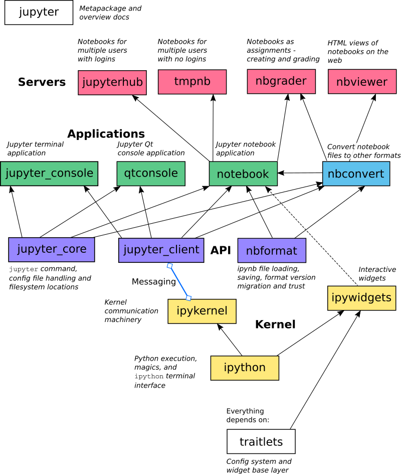

# Jupyter
https://jupyter-notebook.readthedocs.io/en/stable/
Jupyter作为核心，有notebook(web),console, jupyterlab(web)等几种交互方式，有多种kernels(语言)支持，可以自行扩展
JupyterLab is a next-generation web-based notebook
jupyter自带notebook, jupyterlab依赖jupyter和notebook

## Install
- `python3 -m pip install jupyterlab`
- `pip3 install jupyterlab`
## Run
```
jupyter notebook
jupyter lab
```
## Config
- 管理kernels:
  - 工具：`jupyter kernelspec -h`
  - 具体位置: 
    - `~/Library/Jupyter/kernels`
    - `{python-install-path}/share/jupyter/kernels`
    - `/usr/local/share/jupyter/kernels/`
- 创建配置文件:
    ```
        # 也可以手动创建
        jupyter notebook --generate-config
        vim ~/.jupyter/jupyter_notebook_config.py
    ```
- 修改配置文件
    ```
        c.NotebookApp.ip='*' #外部IP地址客户端可以访问
    ```
- 运行时创建的配置文件
    `~/Library/Jupyter/runtime/kernel-xxx.json`
    - shell_port: 前端命令输入端口,
    - iopub_port: kernel发布消息的端口,
    - stdin_port: kernel读取input的端口，跟shell_port有些不一样，这个是主动模式,
    - control_port: shutdown and restart messages, as well as for debugging messages.
    - hb_port: 心跳端口
## Multi-language support
https://github.com/jupyter/jupyter/wiki/Jupyter-kernels
- Golang
```
https://github.com/gopherdata/gophernotes
docker run -it -p 8888:8888 gopherdata/gophernotes
```
## 一些列子项目
- Jupyter_core:
  - specific directories
  - Search paths
- jupyter_client
- jupyter_server
- Traitlets: a framework that lets Python classes have attributes with type checking, dynamically calculated default values, and ‘on change’ callbacks
- IPython: 交互式Python
- nbviewer: ipynb文件查看器
- notebook: 单账号使用，可以同时开启多个kernel(session)
- jupyterhub: 解决多人使用的问题
    ```
    npm install -g configurable-http-proxy
    python3 -m pip install jupyterhub  
    jupyterhub [-f /path/to/jupyterhub_config.py]
    ```
    or `docker run -d -p 8000:8000 --name jupyterhub jupyterhub/jupyterhub jupyterhub`
- jupyter-kernel-gateway
