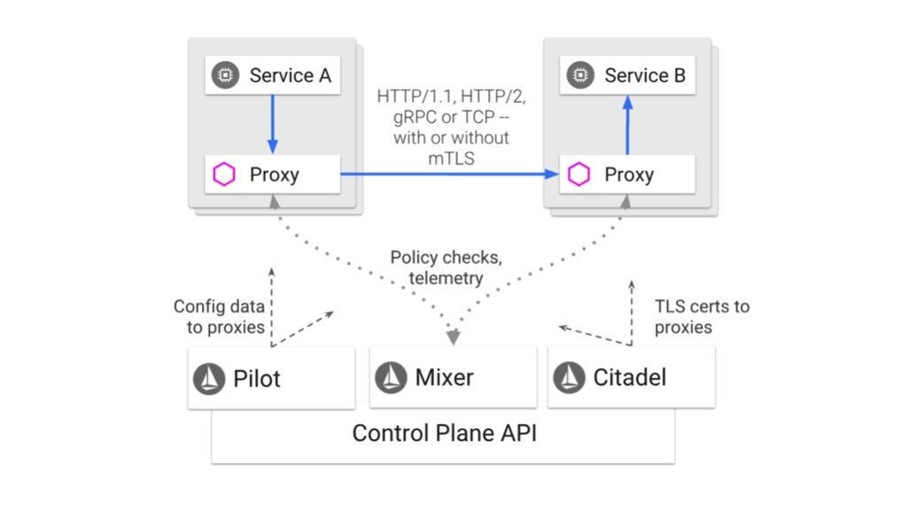

# Istio(意丝帝欧)

## Concept
- 数据平面:
  - Proxy Envoy(HTTP/1.1，HTTP/2，gRPC 或者 TCP)
    - 服务发现
    - 负载均衡
    - 安全传输
    - 多协议支持，例如HTTP/2，gRPC
    - 断路器(Circuit breakers)
    - 健康检查
    - 百分比分流路由
    - 故障注入(Fault injection)
    - 系统度量
- 控制平面:
  - Pilot
    - 为Envoy提供服务发现能力；
    - 为Envoy提供各种智能路由管理能力，例如A/B测试，灰度发布；
    - 为Envoy提供各种弹性管理能力，例如超时，重试，断路策略；
  - Mixer(为整个集群执行访问控制)
    - 和Envoy通讯，实时各种策略
    - 和Envoy通讯，收集各种数据
  - Citadel:安全相关的组件(证书服务，提供TLS)
  - Galley:一个配置获取、校验、处理、分发的组件
- 功能
  - Traffic management：控制中心可以从集群中获取所有服务的信息，并分发给代理，这样代理就能根据用户的期望来完成服务之间的通信（自动地服务发现、负载均衡、流量控制等）
  - Security：因为所有的流量都是通过代理的，那么代理接收到不加密的网络流量之后，可以自动做一次封装，把它升级成安全的加密流量
  - Policies：用户可以配置各种规则（比如 RBAC 授权、白名单、Rate Limit 或者 Quota 等），当代理发现服务之间的访问不符合这些规则，就直接拒绝掉。
  - Observability：所有的流量都经过代理，因此代理对整个集群的访问情况知道得一清二楚，它把这些数据上报到控制中心，那么管理员就能观察到整个集群的流量情况了
## Traffic management
- Virtual services: 主要用于服务发现，有点类似网关，可以根据不通的请求，分发到不同的service或同一个service的不同subset上去。提供retry，timeout，Circuit breakers，Fault injection等
- Destination rules: 在同一个service上，建立不同的subset，主要划分版本，可以通过label选择pod
- Gateways:  mesh的对外出入口，AWS的LoadBalancer等
- Service entries: 一般用来将外部服务加入到mesh中去，类似K8S的endpoint；可以不用，Envoy默认会代理没有注册的外部服务，但不能享受istio带来的额外服务
- Sidecars: 类似防火墙，可以控制那些namespace/service可以与其通讯
## Security
