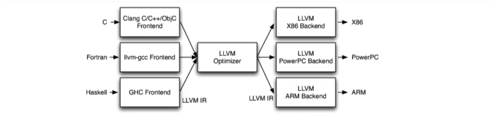

# 编译器
## 编译器的工作原理
基本上都是三段式的:
- 前端: 前端负责解析源代码，检查语法错误，并将其翻译为抽象的语法树；优化器对这一中间代码进行优化，试图使代码更高效；
- 优化器 
- 后端。后端则负责将优化器优化后的中间代码转换为目标机器的代码，这一过程后端会最大化的利用目标机器的特殊指令，以提高代码的性能。
## Clang & LLVM
- Clang: 编译器前端
- LLVM: 编译器后端
不同的前端后端使用统一的中间代码LVM Intermediate Repressentation(LLVM IR)；

基于这个认知，我们可以认为 LLVM 包括了两个概念：一个广义的 LLVM 和一个狭义的 LLVM 。广义的 LLVM 指的是一个完整的 LLVM 编译器框架系统，包括了前端、优化器、后端、众多的库函数以及很多的模块；而狭义的 LLVM 则是聚焦于编译器后端功能的一系列模块和库，包括代码优化、代码生成、JIT 等。
## Clang vs GCC
- Clang是LLVM项目的一个子项目；
- Clang 采用的是 BSD 协议的许可证，而 GCC 采用的是 GPL 协议，显然前者更为宽松；
- Clang 是一个高度模块化开发的轻量级编译器，编译速度快（比GCC块3倍）、占用内存小（GCC的五分之一）、有着友好的出错提示。
## New Language
如果需要支持一种新的变成语言，那额只需要实现一个新的前端；
如果需要支持一种新的硬件设备，那额只需要实现一个新的后端；

## Android
libc++ 来代替 libstdc++。libc++ 和 libstdc++ 这两个库有关系呢？它们两个都是 C++ 标准库，libc++ 是针对 Clang 编译器特别重写的 C++ 标准库，而 libstdc++ 则是 GCC 的对应 C++ 标准库了。从 Android 市场来说，Android NDK 已在具体应用中放弃了 GCC，全面转向 Clang
