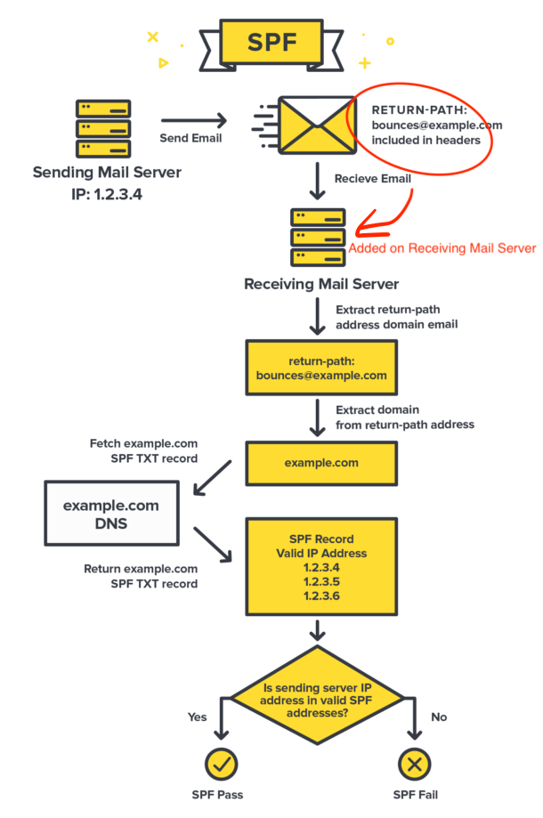
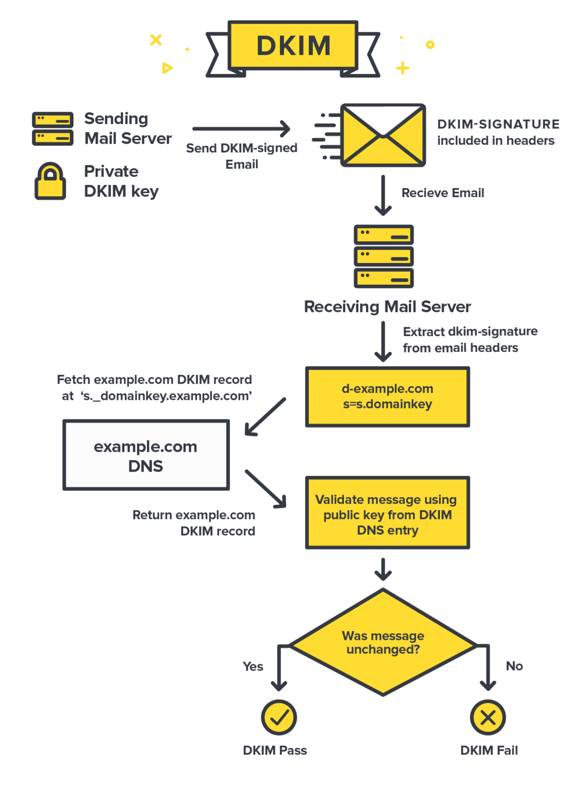
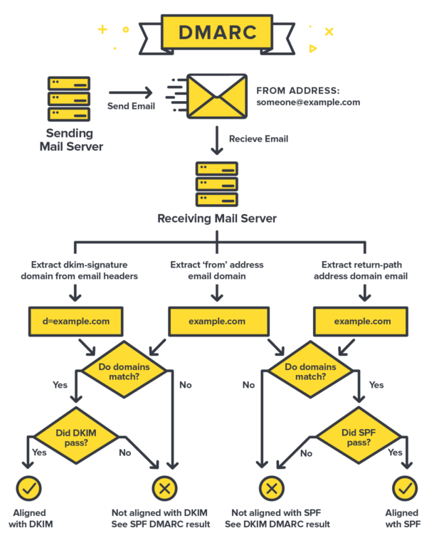
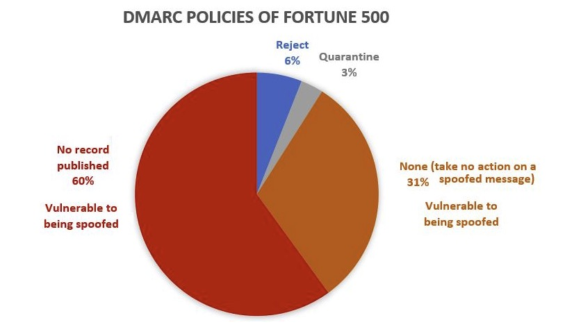

# Email Security
- Spam
- Spoofing/Phishing
  - Top Source
    - Security WARNING
    - Vocation Ajuest
    - UPS No
    - Breaking News
    - Delivery Packages
    - Change Medical Info
    - Change Password
    - Change Verify Code
    - Login Activity WARNING
    - Urgent Action Required
- Privacy Security
  - Leak Sender's IP address(The IP of the email sender used when sending the email will be included in the header field. People received the email can get the location via ip. Part of ISP will hide the ip address, such as send gmail via web[gmail.com], but NOT from client）
  - Email senders can track the receipts' IP and actions via image tracking technology
## Attacking methods
1. Password violent cracking
2. get session via XSS/CSRF (web)
3. Domain spoofing:`biṇance.com vs binance.com` (U+1E47)
4. Name spoofing(like Domain spoofing)：Use a display name or username similar with somebody
5. URL spoofing: `<a href="http://foo.com">boo.com</a>`
6. Virus in attachment
7. Forge return-path
8. Forge email address
## Defending
### ISP(What ISP SHOULD do)
- SPF(Sender Policy Framework)
  - 
  - https://tools.ietf.org/html/rfc7208
  - SPF verifies that the sender's IP is authenticated
- DKIM(DomainKeys Identified Mail)(RFC6376)
  - 
  - https://tools.ietf.org/html/rfc6376
  - DKIM verifies that message content is authentic and not changed.
- DMARC(Domain-based Message Authentication, Reporting & Conformance)(2012)
  - 
  - https://tools.ietf.org/html/rfc7489
  - DMARC is based on SPF and DKIM
- PTR: retrivee domain from IP
- Black list of IP / email address database(Mail Alliances Share Info)
- Avoid XSS/CSRF bug(in web)
- MFA
  - Two-Factor-Authorication/Two-Step-Authorication
  - One Time Token
  - Hardware(One Time Token Upgrade version)
- SASL Authorication
- Spam filter
### Client(What we can do)
1. WARNING on domain spoofing
  - integrate a famous ISP domain in client
  - filter word including：l and 1，unicode ṇ and n, etc
2. Duplicate Display Name WARNING
3. Url spoofing WARNING
4. SPF/DKIM/DMARC Checking(Doing)
5. Hide Send's IP address via proxy
6. Hide Receipts's IP address and actions via remove tracking script(Done in anti-tracking feature)
## Anti-Spoofing Mail Alliances
- XBL(Exploits Block List)
- SBL(The Spamhaus Block List)
- PBL(The Policy Block List)
- ZEN:
- DBL:(The Domain Block List)
- ROKSO
## Current
https://docs.microsoft.com/en-us/microsoft-365/security/office-365-security/anti-spoofing-protection
- 
## Releated Headers
- Return-Path:
- Received-SPF:
- Authentication-Results: dkim=pass,spf=pass,dmarc=pass
- DKIM-Signature:
- ARC-Authentication-Results: 
- ARC-Message-Signature:
- ARC-Seal:
### State of Edison Email
- edison.tech(33% is OK)
  - SPF: NEUTRAL
  - DKIM: PASS
  - DMARC: Not available
## Tools
https://www.spamhaus.org/lookup/  
https://dmarc.postmarkapp.com/  
https://www.mail-tester.com/spf-dkim-check  
https://www.dmarcanalyzer.com/spf/checker/  
https://www.dmarcanalyzer.com/dkim/dkim-check/  
https://www.dmarcanalyzer.com/dmarc/dmarc-record-check/  
https://toolbox.googleapps.com/apps/checkmx/
hunter.io查询域名对应的email地址
https://hunter.io/email-verifier/weicheng@edison.tech