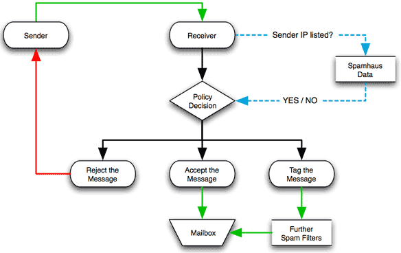
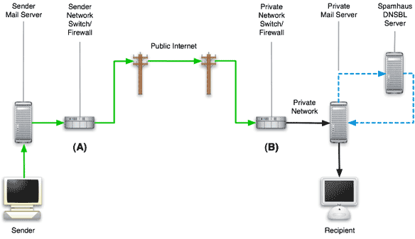

# 邮件安全
## 流程图



## 国际反垃圾邮件组织(spamhaus)
- XBL(Exploits Block List): 它是针对因为安全问题被劫持（比如僵尸机）或是蠕虫/病毒，带有内置式垃圾邮件引擎和其他类型的木马来发垃圾邮机器的实时黑名单IP列表。它的数据主要来源于两个合作组织：cbl.abuseat.org及www.njabl.org.因为被列入XBL的服务器大多为被第三方劫持利用，所以有可能导致误判断。
- SBL(The Spamhaus Block List)：它是已经经过验证的垃圾邮件源及确有垃圾邮件发送行为的实时黑名单列表。它也是spamhaus最主要的项目之一，由分布在全世界9个国家的,每周7天，每天24小时进行列入新记录和删除记录的工作。所以，这个列表可信度高使用人数也多。如果你被列入算是严重事件，被列入后，需要你的ISP（电信或是网通）的IP管理人员去和Spamhaus联系才有可能移除。
- PBL(The Policy Block List):它主要是包含动态IP及哪些允许未经验证即可发送邮件的SMTP服务器的IP地址段。这一个列表最明显的特点就是提供了一个IP地址移除的自助服务，IP它列入后，可以自己申请移除。所以就算是被PBL列入，影响并不大，请要使用移除功能移除即可。
- ZEN: 是上面三个的合集，即包括上面XBL，SBL，PBL的数据。
- DBL:(The Domain Block List)：它是针对因垃圾邮件源而建立的基于域名的黑名单列表。
- ROKSO
## 反垃圾邮件：保护自己别被列如黑名单
各大邮件服务商需要尽量避免自己成为垃圾邮件源，否则容易被标注进入黑名单
- SPF(Sender Policy Framework)
  - https://tools.ietf.org/html/rfc7208
  - SPF是为了防范伪造发件人地址发送垃圾邮件而提出的一种开放式标准，是一种以IP地址认证电子邮件发件人身份的技术。域名所有者通过在DNS中发布SPF记录来授权合法使用该域名发送邮件的IP地址。
  - 当在DNS中定义了域名的SPF记录后，为了确认邮件声称发件人不是伪造的，邮件接收方首先检查邮件域名的SPF记录，来确定发件人的IP地址是否被包含在SPF记录中，若包含，则认为是一封正确的邮件，否则认为是一封伪造的邮件并退回，或将其标记为垃圾/仿冒邮件。
  - 设置正确的SPF记录可以提高邮件系统发送外域邮件的成功率，也可以一定程度上防止被假冒域名发送邮件。
  - 在TXT中有一条记录: start with `v=spf1`. Example:`v=spf1 include:_spf.google.com ~all`
- DKIM(DomainKeys Identified Mail)(RFC6376)
  - DKIM verifies that message content is authentic and not changed.
  - 目前有微软推出的Sender ID作为其唯一的竞争者，不过两者应用差距明显
  - 配置DMARC
    - 创建子域名: `_dmarc.yourdomain`
    - 查询: `dig +short TXT _dmarc.yourdomain`
    - 公钥存储在: `(selector)._domainkey.yourdomain`
- DMARC(Domain-based Message Authentication, Reporting & Conformance)(2012)
  - https://tools.ietf.org/html/rfc7489
  - DMARC是一种基于现有的SPF和DKIM协议的可扩展电子邮件认证协议，在邮件收发双方建立了邮件反馈机制，便于邮件发送方和邮件接收方共同对域名的管理进行完善和监督。
  - 当Mail Receiver方（其MTA需支持DMARC协议）收到该域发送过来的邮件时，则进行DMARC校验，若校验失败还需发送一封report到指定[URI]（常是一个邮箱地址）
## 帮助工具
https://www.spamhaus.org/lookup/
http://www.mail-tester.com/
https://toolbox.googleapps.com/apps/checkmx/
## PTR(反向域名解析)
国外部分邮件服务商会对收到的邮件进行反向域名解析`dig -x  IP`
PTR和SPF有部分重合，PTR是从ISP那边配置的，SPF是从域名服务商那边配置
## Example
#### MX and SPF
```
C: dig MX 126.com
S:  126.com	mail exchanger = 10 126mx02.mxmail.netease.com.
    126.com	mail exchanger = 10 126mx01.mxmail.netease.com.
    126.com	mail exchanger = 50 126mx00.mxmail.netease.com.
    126.com	mail exchanger = 10 126mx03.mxmail.netease.com.
C: dig TXT 126.com
S: v=spf1 include:spf.163.com -all
C: dig TXT spf.163.com
S: v=spf1 include:a.spf.163.com include:b.spf.163.com include:c.spf.163.com include:d.spf.163.com include:e.spf.163.com -all
```
递归查询a-e.spf.163.com得到
```
v=spf1 ip4:220.181.12.0/22 ip4:220.181.31.0/24 ip4:123.125.50.0/24 ip4:220.181.72.0/24 ip4:123.58.178.0/24 ip4:123.58.177.0/24 ip4:113.108.225.0/24 ip4:218.107.63.0/24 ip4:123.58.189.128/25 ip4:123.126.96.0/24 ip4:123.126.97.0/24 -all
省略...
```
其中我们126.com常用的IP发送地址`220.181.15.111`属于`220.181.12.0/22`段号.
```
前22位为网络号，后10位为机器号
xxxxxxxx.xxxxxxxx.xxxxxxxx.xxxxxxxx
                  00001100
220.181.12-15.xxx
```
#### SMTP
我们通过`nslookup smtp.126.com`查询得到网易的
smtp服务器列表:`220.181.15.111-114`
MX的服务器列表:`220.181.15.131-209`
网易邮箱禁止了使用MX的邮箱当成SMTP邮箱发送邮件
`Local user is not allowed,126 mx1,H8mowADXbKL72nFdnOR5CQ--.47537S2 1567742717`
#### DKIM(DKIM-Signature字段)
```
DKIM-Signature: v=1; a=rsa-sha256; d=example.net; s=s110527;
c=simple; q=dns/txt; i=@eng.example.net;
t=1117574938; x=1118006938;
h=from:to:subject:date;
z=From:foo@eng.example.net|To:joe@example.com|Subject:demo=20run|Date:July=205,=202005=203:44:08=20PM=20-0700;
bh=MTIzNDU2Nzg5MDEyMzQ1Njc4OTAxMjM0NTY3ODkwMTI=;
b=dzdVyOfAKCdLXdJOc9G2q8LoXSlEniSbav+yuU4zGeeruD00lszZVoG4ZHRNiYzR
```
- 公钥存储在`s`指定的selector+`_domainkey`+`d`指定的domain中
`s110527._domainkey.126.com	text = "v=DKIM1; k=rsa; p=MIGfMA0GCSqGSIb3DQEBAQUAA4GNADCBiQKBgQCp9JpS7EORNjwIntXII17mJuwob+hJoVmHr2h2HPpSE7QYgh815kHdYC4JbxXgcP0mNZOY3R1Vk6dUDR8NQiL+xB9fRNWFS36Tq7CzPE/UI/+PxWhPzPnvABr4gbQcres8ee9cgEMPFDpck4O7ULNJNxH003Ofcmh1K+xDGyqPWQIDAQAB"`
#### Example
```
_dmarc.gmail.com	text = "v=DMARC1; p=none; sp=quarantine; rua=mailto:mailauth-reports@google.com"
_dmarc.hotmail.com	text = "v=DMARC1; p=none; rua=mailto:d@rua.agari.com;ruf=mailto:d@ruf.agari.com;fo=1:s:d"
_dmarc.office365.com	text = "v=DMARC1; p=reject; pct=100; rua=mailto:d@rua.agari.com; ruf=mailto:d@ruf.agari.com; fo=1"
_dmarc.yahoo.com	text = "v=DMARC1; p=reject; pct=100; rua=mailto:dmarc_y_rua@yahoo.com;"
_dmarc.hushmail.com	text = "v=DMARC1; p=quarantine; pct=100; rua=mailto:dmarc-rua@hushmail.com"
_dmarc.126.com	text = "v=DMARC1; p=none;"
_dmarc.qq.com	       text = "v=DMARC1; p=none; rua=mailto:mailauth-reports@qq.com"
_dmarc.aliyun.com	text = "v=DMARC1; p=quarantine; pct=5;rua=mailto:dmarc@service.aliyun.com;"
_dmarc.alipay.com	text = "v=DMARC1; p=quarantine; rua=mailto:dmarc_ay@service.alibaba.com; ruf=mailto:dmarc_ay@service.alibaba.com"
```
#### 信头参数详解
```
v= 版本号（纯文本，必要的），值为1
       格式：v=1*DIGIT
a= 生成签名的算法（纯文本，必要的），验证者必须支持“rsa-sha1”和“rsa-sha256”两种算法，签名者使用“rsa-sha256”签名。
       格式：a=rsa-sha1或者a=rsa-sha256
b= 签名数据（base64，必要的）
       格式：b=base64string
bh= 消息的规范化主体的哈希值，受“l=”标签限制（base64，必要的）。
       格式：bh=base64string
c= 消息规范化算法（纯文本，可选的，默认为“simple/simple”）,"/"两边分别对应头部和主体的规范化算法，当“c=simple”或者“c=relaxed”时，表示头部规范化算法使用simple或者relaxed，而主体规范化算法默认为simple。
       格式：c=sig-c-tag-alg["/"sig-c-tag-alg]
              sig-c-tag-alg="simple"/"relaxed"
d= Signing Domain Identifier ，即SDID （纯文本，必要的）
       格式：d=domain-name
h= 签名的头字段（纯文本，必要的），提交给签名算法的头字段名称列表，用“:”分隔。
       格式：h=hdr-name*(":"hdr-name)
i= Agent or User Identifier ，即AUID，值为@domain
       格式：i=[Local-part]"@"domain-name
                     Local-part为空，domain-name与“d=”的值一样或者是其子域。
l= 主体长度数（纯文本无符号十进制整型，可选的，默认为整个主体）
       格式：l=1*76DIGIT
q= 一个查询方式的列表，以冒号分隔，用于检索公钥（纯文本，可选的，默认为“dns/txt”），每个查询方式的形式为“type[/options]”。
       格式：q=dns/txt
s= selector，（纯文本，必要的）
       格式：s=selector
t= 签名时间戳（纯文本无符号十进制整型；推荐的，默认为一个未知的创建时间）。
       格式：t=1*12DIGIT
x= 签名到期时间（纯文本无符号十进制整型；推荐的，默认永不过期）
       格式：x=1*12DIGIT
z= 复制的头字段（dkim-quoted-printable，可选的，默认为null）
       格式：z=sig-z-tag-copy*（"|"sig-z-tag-copy）
              sig-z-tag-copy= hdr-name":"qp-hdr-value
```
## 当前状况
- 250OK今年8月新出的一份DMARC报告显示，律所在安全协议采用上走在各行业前列，但其采纳率也仅有1/3这么点儿。大部分其他公司的采纳率微乎其微。
- 250OK的研究与Agari早些时候的调查遥相呼应。Agari发现，财富500强企业中恰当实现了DMARC的仅占8%，仅2%的域名有所防护。
- 设置DMARC、DKIM和SPF并不容易，且易受运营商错误影响
- 国内的万网是不支持DKIM，目前新网是支持SPF和DKIM。
## 相关Header
- Received-SPF
- Authentication-Results
- DKIM-Signature