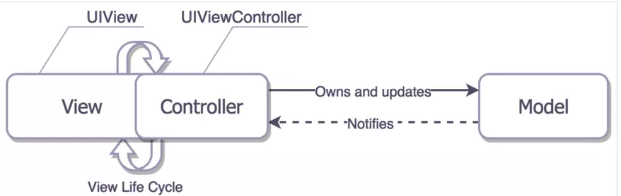
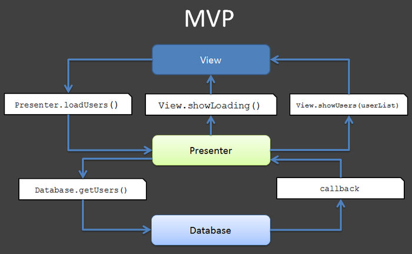
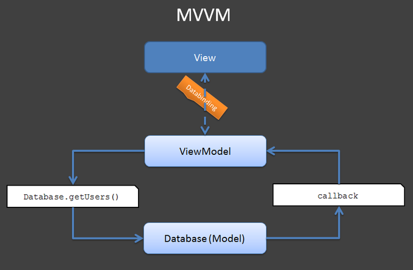

# 设计模式
## 设计模式原则
- 单一指责
- 依赖倒转
- 接口隔离
## 总体来说设计模式分为三大类：
#### 创建型模式，共五种：
- 工厂方法模式
- 抽象工厂模式
- 单例模式
- 建造者模式
- 原型模式
#### 结构型模式，共七种：
- 适配器模式*
    ```
        class A{
            void f1() {}
        }
        interface I {
            void f1();
            void f2();
        }
        class B extends A implements I {
            void f1(){}
            void f2(){}
        }
    ```
- 装饰器模式
    装饰模式就是给一个对象增加一些新的功能，而且是动态的，要求装饰对象和被装饰对象实现同一个接口，装饰对象持有被装饰对象的实例。
- 代理模式
    跟装饰器模式非常像。装饰器模式关注于在一个对象上动态的添加方法，然而代理模式关注于控制对对象的访问。用代理模式，代理类（proxy class）可以对它的客户隐藏一个对象的具体信息。因此，当使用代理模式的时候，我们常常在一个代理类中创建一个对象的实例。并且，当我们使用装饰器模 式的时候，我们通常的做法是将原始对象作为一个参数传给装饰者的构造器。
- 外观模式
    将几个类封装到一个类里面去，然后通过这个类调用内部的几个类
- 桥接模式
    可以动态设置被代理的对象
    ```
    public class SourceSub1 implements Sourceable {
        public void method() {  
            System.out.println("this is the first sub!");  
        }
    }
    public class SourceSub2 implements Sourceable {
        public void method() {  
            System.out.println("this is the second sub!");  
        }
    }
    public abstract class Bridge {  
        private Sourceable source;  
    
        public void method(){  
            source.method();  
        }  
        
        public Sourceable getSource() {  
            return source;  
        }  
    
        public void setSource(Sourceable source) {  
            this.source = source;  
        }  
    }  
    ```
- 组合模式
- 享元模式
#### 行为型模式，共十一种：
- 策略模式
- 模板方法模式
- 观察者模式
- 迭代子模式
- 责任链模式
- 命令模式
- 备忘录模式
- 状态模式
- 访问者模式
- 中介者模式
- 解释器模式
## 设计模式
https://www.jianshu.com/p/2ad25e2769b5
#### MVC
三者之间一定要明确的定义为单向依赖，而不应该出现双向依赖
- User->C->M->V
    - Controller<--N:1-->View
    - C 引用了Model，View引用了Model
    - View 需要知道 Model
- User->V->C->M->V（Web）
- massive controller

#### MVP
User->V<->P<->M
- View和Model完全隔离
- Presenter负责提供数据和如何渲染View
这里又有两种不同的实现方式：
让P持有V，P通过V的暴露接口改变V的显示数据和状态，P通过V的事件回调来执行自身的业务逻辑
让V持有P，V通过P的代理回调来改变自身的显示数据和状态，V直接调用P的接口来执行事件响应对应的业务逻辑

#### MVVM
User:V<-->VM<-->M
- V单向引用ViewModel，VM不知道V的存在
- View和Model完全隔离
- 数据双向绑定
- VM负责提供数据，但如何渲染由View自行决定

#### 总结
MVVM是从MVP模型中演变过来，主要隔离了V和M，双向绑定技术不是必须
真正将前台代码开发者（JS+HTML）与后台代码开发者分离的模式，适合和Web开发