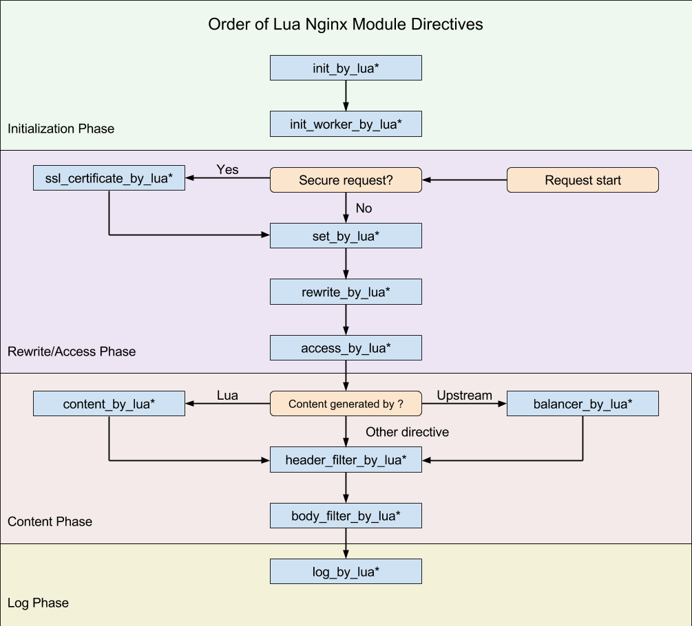

# Openresty
Nginx + Lua, 集成了一些有用的nginx module的一个框架。
openresty命令本身也是一个快捷方式到nginx
## lua-nginx
lua-nginx-module有几个版本
- openresty 版本
- nginx 自带的版本
- apache lua-mod
## 参考地址

包括了指令和ngx.ctx等
https://github.com/openresty/lua-nginx-module
## 开发
- ngx.log
- ngx.say()自动加回车,ngx.print()
- ngx.exit(404)
- ngx.var.xxx 只能存string, nginx 里面的变量($xxx), 大部分只读，推荐使用Openresty里面对应的接口（ngx.req）
    ngx.var.args --uri里的$args
- ngx.ctx.xxx 灵活
- ngx.req.xxx: get_headers(), set_header
- 响应:
    ngx.header.xxx or ngx.header['xxx']
- ngx.location.capture or ngx.location.capture_multi
- ngx.socket.xxx
- 多线程:nginx默认是多进程，单线程的。Openresty扩展的: 
    ngx.timer.at
    ngx.thread.spawn(fun,arg1,arg2,...)
- ngx.redirect(uri, status)
- ngx.exec(/xxx) 内部跳转
- 共享内存
    `lua_shared_dict myname size`  只能在http指令下
    `local myname = ngx.shared.myname`
    方法: set,safe_set,add,safe_add,replace, get,get_stale,delete

