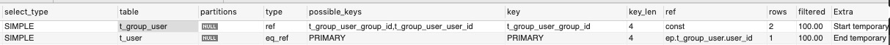
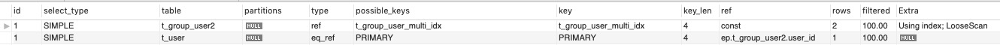
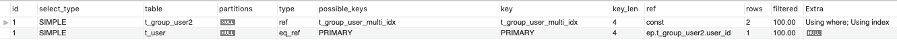
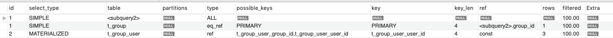
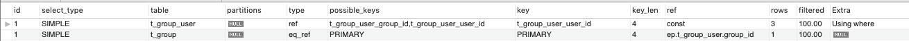
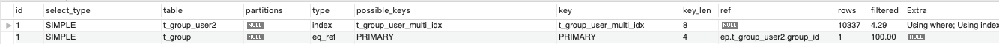
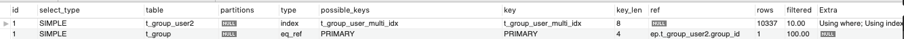
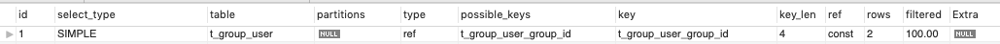

# 实验课
## 实验目的：通过EXPLAIN检查索引设置效果和查询性能
## 准备工作:
```
CREATE TABLE `t_group` (
  `id` int(11) NOT NULL AUTO_INCREMENT,
  `name`    varchar(45) NOT NULL,
  `desc`    varchar(45),
  PRIMARY KEY (`id`),
  KEY `t_group_name` (`name`)
) ENGINE=InnoDB DEFAULT CHARSET=utf8;

CREATE TABLE `t_user` (
  `id` int(11) NOT NULL AUTO_INCREMENT,
  `name`    varchar(45) NOT NULL,
  `email`   varchar(45) NOT NULL,
  PRIMARY KEY (`id`),
  KEY `t_user_name` (`name`),
  UNIQUE KEY `t_user_email_UNIQUE` (`email`)
) ENGINE=InnoDB DEFAULT CHARSET=utf8;
-- 使用两个单独索引
CREATE TABLE `t_group_user` (
  `id` int(11) NOT NULL AUTO_INCREMENT,
  `group_id` int(11) NOT NULL,
  `user_id` int(11) NOT NULL,
  `rold`    varchar(45),
  PRIMARY KEY (`id`),
  KEY `t_group_user_group_id` (`group_id`),
  KEY `t_group_user_user_id` (`user_id`)
) ENGINE=InnoDB DEFAULT CHARSET=utf8;
-- 使用一个联合索引，group_id在前，user_id在后
CREATE TABLE `t_group_user2` (
  `id` int(11) NOT NULL AUTO_INCREMENT,
  `group_id` int(11) NOT NULL,
  `user_id` int(11) NOT NULL,
  `rold`    varchar(45),
  PRIMARY KEY (`id`),
  KEY `t_group_user_multi_idx` (`group_id`,`user_id`)
) ENGINE=InnoDB DEFAULT CHARSET=utf8;
```
## 查询分析
业务|SQL实现|分析
-|-|-
查询所有group|SELECT * FROM t_group|全表扫描
根据主键id查询|SELECT * FROM t_group WHERE id =1;|利用主键，常数时间
查询最大ID|SELECT MAX(id) FROM t_user;|B-Tree最右边节点
查询明显不存在的|SELECT * FROM t_user WHERE id=-1|提前终止
## 功能设计
- 统计A,B,C三个Group底下分别有多少人
- 提取出人数大于N个的Group(id,name)
    Case|SQL|备注
    :-:|-|-
    IN|SELECT t1.id,t1.name FROM t_group as t1 WHERE id IN (SELECT group_id FROM t_group_user GROUP BY group_id HAVING count(group_id)>1);|
    IN(FORCE INDEX)|SELECT t1.id,t1.name FROM t_group as t1 FORCE INDEX (PRIMARY) WHERE id IN (SELECT group_id FROM t_group_user GROUP BY group_id HAVING count(group_id)>1);
    JOIN|SELECT t2.group_id,t1.name FROM t_group as t1 JOIN t_group_user as t2 ON t1.id = t2.group_id group by t2.group_id,t1.name HAVING COUNT(t2.group_id)>1;

## 性能分析
- 案例1: Group<->User
    1. 查询User(t_group_user,子查询):`SELECT t_user.* FROM t_user WHERE t_user.id IN (SELECT t_group_user.user_id  FROM t_group_user WHERE t_group_user.group_id=1);`
    
    2. 查询User(t_group_user,join):`SELECT t_user.* FROM t_user LEFT JOIN t_group_user ON t_group_user.user_id=t_user.id  WHERE t_group_user.group_id=1;`
    
    3. 查询User(t_group_user2,子查询):`SELECT t_user.* FROM t_user WHERE t_user.id IN (SELECT t_group_user2.user_id  FROM t_group_user2 WHERE t_group_user2.group_id=1);`
    
    4. 查询User(t_group_user2,join):`SELECT t_user.* FROM t_user LEFT JOIN t_group_user2 ON t_group_user2.user_id=t_user.id  WHERE t_group_user2.group_id=1;`
    
    5. 查询Group(t_group_user,子查询),全表扫描:`SELECT t_group.* FROM t_group WHERE t_group.id IN (SELECT t_group_user.group_id  FROM t_group_user WHERE t_group_user.user_id=1);`
    
    6. 查询Group(t_group_user,join):`SELECT t_group.* FROM t_group LEFT JOIN t_group_user ON t_group_user.group_id=t_group.id  WHERE t_group_user.user_id=1;`
    
    7. 查询Group(t_group_user2,子查询),LooseScan:`SELECT t_group.* FROM t_group WHERE t_group.id IN (SELECT t_group_user2.group_id  FROM t_group_user2 WHERE t_group_user2.user_id=1);`
    
    8. 查询Group(t_group_user2,join):`SELECT t_group.* FROM t_group LEFT JOIN t_group_user2 ON t_group_user2.group_id=t_group.id  WHERE t_group_user2.user_id=1;`
    
- 案例2: 覆盖测试
    1. 通过t_group_user:`SELECT t_group_user.group_id, t_group_user.user_id  FROM t_group_user WHERE t_group_user.group_id=1;`. 未使用了覆盖索引
    
    2. 通过t_group_user2:`SELECT t_group_user2.group_id, t_group_user2.user_id  FROM t_group_user2 WHERE t_group_user2.group_id=1;`.使用了覆盖索引
    
- 案例3: EXISTS VS IN
    CASE|SQL|备注
    :-:|-|-
    EXISTS|SELECT * FROM t_user WHERE EXISTS (SELECT 1 FROM t_group_user WHERE t_user.id=t_group_user.user_id AND t_group_user.group_id = 1);|
    IN|SELECT * FROM t_user WHERE id IN (SELECT user_id FROM t_group_user WHERE group_id=1);|
    JOIN|SELECT t_user.* FROM t_user JOIN t_group_user ON  t_user.id=t_group_user.user_id WHERE t_group_user.group_id=1;|
