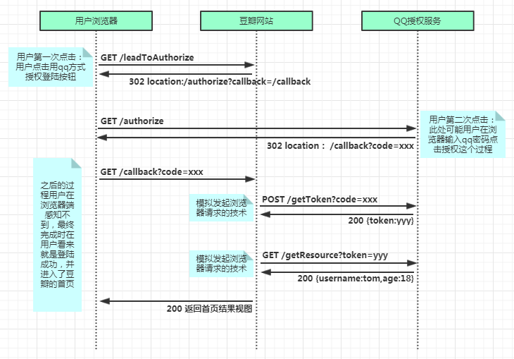
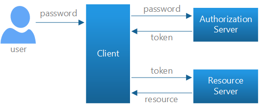

# OAuth四种授权模式
- 授权码模式（authorization code）
  
  ```请求OAuth Server 获取Code
    response_type:表示授权类型，"token/code"，必选项。
    client_id:表示客户端的ID，必选项。
    redirect_uri:表示重定向的URI，可选项。
    scope:表示权限范围，可选项。
    state:表示客户端的当前状态，可以指定任意值，认证服务器会原封不动地返回这个值
  ```
  ```响应Success
    code: authorization_code,一次性使用(response_type=code的情况下)
    state: 如果客户端的请求中包含这个参数，认证服务器的回应也必须一模一样包含这个参数。
  ```
  ```响应Error
    error:
    state:
  ```
  ```请求OAuth Server 获取Token
    client_id:在微博开放平台申请的应用 ID
    client_secret:在微博开放平台申请时提供的APP Secret
    grant_type:需要填写authorization_code
    code:上一步获得的 code
    redirect_url:必须同申请的时候一直
  ```
  ```响应
    access_token:xxxx
    token_type:
    refresh_token:
    expires_in:
    scope:
  ```
- 简化模式（implicit）
  相比授权码模式的情况，就授权服务器返回的不是code，而是直接返回token
   ```请求
     response_type: token
     client_id:
     redirect_uri
     scope
     state
   ```
   ```Success
     access_token:表示访问令牌(response_type=token的情况下)
     token_type:表示令牌类型，该值大小写不敏感(response_type=token的情况下)
     expires_in:表示过期时间，单位为秒。如果省略该参数，必须其他方式设置过期时间。
     scope:表示权限范围，如果与客户端申请的范围一致，此项可省略。
     state:
   ```
   ```Error
     error:
     state:
   ```
- 密码模式（resource owner password credentials）
    
    用户向客户端提供自己的用户名和密码。客户端使用这些信息，向"服务商提供商"索要授权。在这种模式中，用户必须把自己的密码给客户端，但是客户端不得储存密码。这通常用在用户对客户端高度信任的情况下，比如客户端是操作系统的一部分，或者由一个著名公司出品。
- 客户端模式（client credentials）
    指客户端以自己的名义，而不是以用户的名义，向"服务提供商"进行认证。严格地说，客户端模式并不属于OAuth框架所要解决的问题。在这种模式中，用户直接向客户端注册，客户端以自己的名义要求"服务提供商"提供服务，其实不存在授权问题。