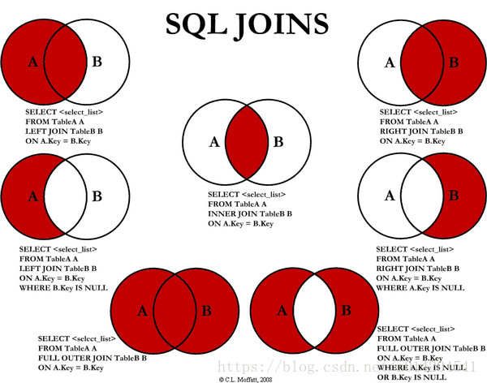

# SQL For MySQL
## 子查询
1. 标量子查询: 是指子查询返回的是单一值的标量，如一个数字或一个字符串，也是子查询中最简单的返回形式.  可以使用: =, >, <, >=, <=, <> 
2. 列子查询:指子查询返回的结果集是 N 行一列，该结果通常来自对表的某个字段查询返回。 可以使用 IN、ANY、SOME 和 ALL 操作符，不能直接(但可以结合)使用 = > < >= <= <> 这些比较标量结果的操作符。
3. 行子查询: 指子查询返回的结果集是 N 列一行。 可以使用: =
4. 表子查询: 指子查询返回的结果集是 N 列 N 行。 可以使用: 同#2
- IN
- ANY
- ALL
- EXISTS
    EXISTS谓词的子查询不返回任何数据，只产生逻辑真值“true”或者逻辑假值“false”。
## JOIN

- 内链接(INNER JOIN)
    - 显式: `SELECT O.ID,O.ORDER_NUMBER,C.ID,C.NAME FROM CUSTOMERS C INNER JOIN ORDERS O ON C.ID=O.CUSTOMER_ID;`
    - 隐式: `SELECT O.ID,O.ORDER_NUMBER,C.ID,C.NAME FROM CUSTOMERS C,ORDERS O WHERE C.ID=O.CUSTOMER_ID;`
- 外连接
    - LEFT OUTER JOIN
    - RIGHT OUTER JOIN
    - FULL OUTER JOIN
    - LEFT/RIGHT JOIN EXCLUDING INNER JOIN
    - OUTER JOIN EXCLUDING INNER JOIN
- 笛卡尔积连接
`CROSS JOIN`， #1如果没有where/on条件查询，作用等价#3
    总结
    - Use CROSS JOIN when and only when you don't compare columns between tables. That is to show that the lack of comparisons was intentional.
    - Use (INNER) JOIN with ON when and only when you compare columns between tables (Plus possibly other conditions.)
    - Don't use comma.
## 查询A表中在(或不在)B表中的记录效率比较（IN,EXISTS,JOIN)
- 在查询的子表较大，执行时间:
    EXISTS <= IN <= JOIN
    NOT EXISTS <= NOT IN <= LEFT JOIN
    当允许NULL时：
    NOT EXISTS <= LEFT JOIN <= NOT IN
- 两个表中一个较小，一个较大，则子查询表大的用exists，子查询表小的用in。
    因为in 是把外表和内表作hash连接，而exists是对外表作loop循环，每次loop循环再对内表进行查询
## 物理连接
- 等值连接：
    - Hash JOIN
    - nested loop:（唯一支持不等式连接的方式）每扫描外表的一行数据都要在内表中查找与之相匹配的行
    - sort merge-join
    hash-join只适用于等值连接，对于>, <, <=, >=这样的查询连接还是需要nested loop这种通用的连接算法来处理。如果连接key本来就是有序的或者需要排序，那么可能用merge-join的代价会比hash-join更小，此时merge-join会更有优势
- 非等值连接
- 自然连接：#1的特例。自然连接必须要有相同的属性列才能进行，即等值连接之后要去除相同的属性列，其他与内链接类似
## Group分组
- Group By
- Having
## 聚合函数
- AVG
    AVG ([DISTINCT] expr) -- 返回expr 的平均值。 DISTINCT 选项可用于返回 expr的不同值的平均值
- COUNT
    - count(*) 全自动选择，一般会选择扫描块最少的列
    - count(1) 大部分数据库会等价#1。 [参考这里](https://stackoverflow.com/questions/1221559/count-vs-count1-sql-server/1221649)
    - count(col_name)，扫描指定列
    > COUNT 以最终选择的列不为空(NULL)进行统计
    索引是一种B+树的结构，以块为单位进行存储。假设块大小是1K，主键索引大小为4B，有一个字段A的索引大小为2B。 
同样一个块，能存放256个主键索引，但是能存放512个字段A的索引。 
假设总数据是2K条，意味着主键索引占用了8个块，而A字段索引占用了4个块，统计时用主键索引需要经历的块多，IO次数多。效率也比A字段索引慢。
- MIN/MAX
- SUM
## 控制流程
- CASE
    `CASE value WHEN [compare-value1] THEN result1 [WHEN [compare-value2] THEN result2 [ELSE result3] END` 
- IF:`IF(expr1,expr2,expr3)`
    如果表达式expr1是TRUE ，则 IF()的返回值为expr2; 否则返回值则为 expr3。类似于三目运算符。
- IFNULL:`IFNULL(expr1,expr2)`
    假如expr1不为NULL，则函数返回值为 expr1; 否则，如果如expr1为NULL，函数返回值为expr2。
- NULLIF:`NULLIF(expr1,expr2)`

